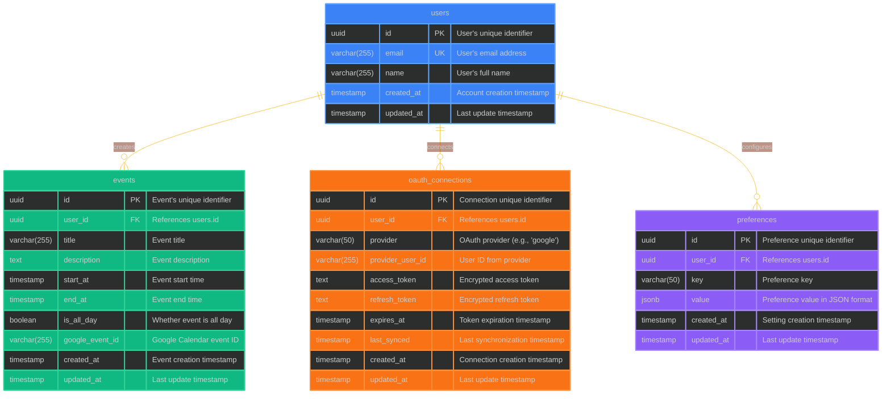
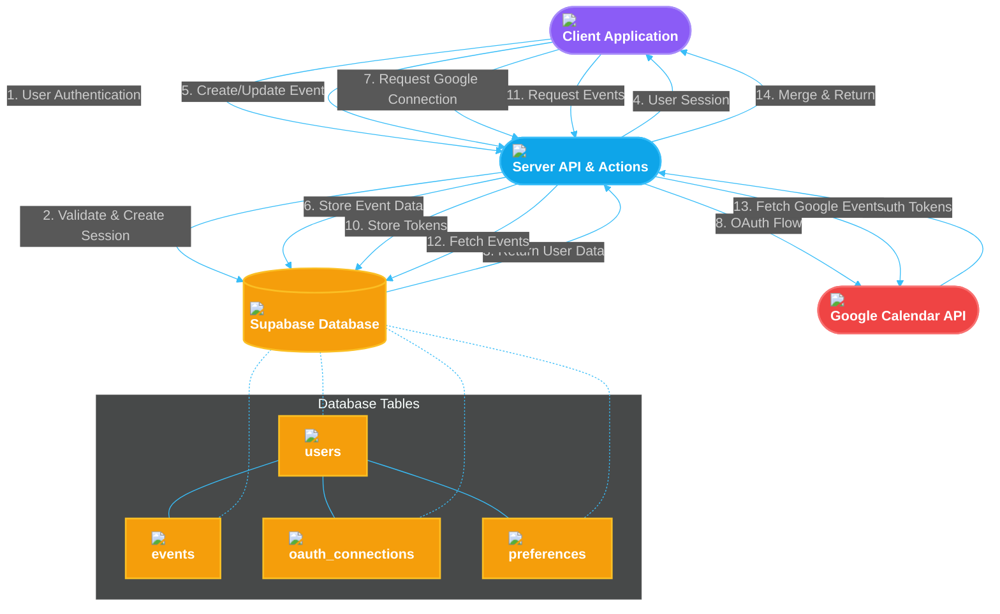

# SKILLIZE MVP - DATABASE SCHEMA

## Database Overview

Skillize MVP uses Supabase as its database solution, which is built on PostgreSQL. This document outlines the database tables, their relationships, and key considerations for each entity.

The core features supported by our database schema include:
- User authentication and profile management
- Calendar event storage and retrieval
- OAuth integration with Google Calendar
- User preferences and settings

## Database Schema Diagram



## Data Model Visualization

The following diagram shows how the database entities are represented in the application code:

```mermaid
%%{init: {'theme': 'dark', 'themeVariables': { 'fontSize': '16px', 'primaryColor': '#3b82f6', 'primaryTextColor': '#fff', 'primaryBorderColor': '#3b82f6', 'lineColor': '#93c5fd', 'tertiaryColor': '#1e3a8a' }}}%%
classDiagram
    direction TB
    
    class User {
        <<Interface>>
        +string id
        +string email
        +string name
        +Date createdAt
        +Date updatedAt
        +getEvents() Event[]
        +getPreferences() UserPreferences
        +hasGoogleConnection() boolean
    }
    
    class Event {
        <<Interface>>
        +string id
        +string userId
        +string title
        +string? description
        +Date startAt
        +Date endAt
        +boolean isAllDay
        +string? googleEventId
        +Date createdAt
        +Date updatedAt
        +getUser() User
        +syncWithGoogle() Promise~void~
    }
    
    class OAuthConnection {
        <<Interface>>
        +string id
        +string userId
        +string provider
        +string providerUserId
        +string accessToken
        +string? refreshToken
        +Date expiresAt
        +Date? lastSynced
        +Date createdAt
        +Date updatedAt
        +getUser() User
        +isExpired() boolean
        +refresh() Promise~boolean~
    }
    
    class UserPreferences {
        <<Interface>>
        +string id
        +string userId
        +Map~string,any~ preferences
        +Date createdAt
        +Date updatedAt
        +getUser() User
        +getTheme() string
        +setTheme(theme: string) void
        +getCalendarView() string
        +setCalendarView(view: string) void
    }
    
    class GoogleCalendarService {
        <<Service>>
        -OAuthConnection connection
        +constructor(connection: OAuthConnection)
        +getEvents(startDate: Date, endDate: Date) Promise~Event[]~
        +createEvent(event: Event) Promise~string~
        +updateEvent(event: Event) Promise~boolean~
        +deleteEvent(eventId: string) Promise~boolean~
        +sync() Promise~SyncResult~
    }
    
    class SyncResult {
        <<Interface>>
        +number added
        +number updated
        +number deleted
        +Date syncTime
    }
    
    class EventRepository {
        <<Repository>>
        +findById(id: string) Promise~Event~
        +findByUserId(userId: string) Promise~Event[]~
        +findByDateRange(userId: string, startDate: Date, endDate: Date) Promise~Event[]~
        +create(data: CreateEventParams) Promise~Event~
        +update(id: string, data: UpdateEventParams) Promise~Event~
        +delete(id: string) Promise~boolean~
    }
    
    class UserRepository {
        <<Repository>>
        +findById(id: string) Promise~User~
        +findByEmail(email: string) Promise~User~
        +create(data: CreateUserParams) Promise~User~
        +update(id: string, data: UpdateUserParams) Promise~User~
        +delete(id: string) Promise~boolean~
    }
    
    User "1" -- "many" Event : creates
    User "1" -- "many" OAuthConnection : has
    User "1" -- "1" UserPreferences : has
    OAuthConnection "1" -- "1" GoogleCalendarService : powers
    Event -- GoogleCalendarService : syncs with
    UserRepository -- User : manages
    EventRepository -- Event : manages
    GoogleCalendarService -- SyncResult : produces
    
    %% Styling
    class User fill:#3b82f6,stroke:#60a5fa,stroke-width:2px,color:white
    class Event fill:#10b981,stroke:#34d399,stroke-width:2px,color:white
    class OAuthConnection fill:#f97316,stroke:#fb923c,stroke-width:2px,color:white
    class UserPreferences fill:#8b5cf6,stroke:#a78bfa,stroke-width:2px,color:white
    class GoogleCalendarService fill:#ef4444,stroke:#f87171,stroke-width:2px,color:white
    class SyncResult fill:#ef4444,stroke:#f87171,stroke-width:2px,color:white
    class EventRepository fill:#0ea5e9,stroke:#38bdf8,stroke-width:2px,color:white
    class UserRepository fill:#0ea5e9,stroke:#38bdf8,stroke-width:2px,color:white
```

## Database and Application Flow

The following diagram illustrates the flow of data between the client, server, and database:



## Table Definitions

### Users

The `users` table stores information about application users.

| Column | Type | Description | Constraints |
|--------|------|-------------|-------------|
| `id` | uuid | Unique identifier | Primary Key, Default: `gen_random_uuid()` |
| `email` | varchar(255) | User email address | Unique, Not Null |
| `name` | varchar(255) | User full name | Not Null |
| `created_at` | timestamp | Account creation time | Not Null, Default: `now()` |
| `updated_at` | timestamp | Last update time | Not Null, Default: `now()` |

**Indexes**:
- Primary Key: `id`
- Unique: `email`

**SQL Definition**:
```sql
CREATE TABLE users (
  id UUID PRIMARY KEY DEFAULT gen_random_uuid(),
  email VARCHAR(255) UNIQUE NOT NULL,
  name VARCHAR(255) NOT NULL,
  created_at TIMESTAMP WITH TIME ZONE NOT NULL DEFAULT now(),
  updated_at TIMESTAMP WITH TIME ZONE NOT NULL DEFAULT now()
);

-- Trigger to automatically update the updated_at column
CREATE TRIGGER set_users_updated_at
BEFORE UPDATE ON users
FOR EACH ROW
EXECUTE FUNCTION update_timestamp();
```

### Events

The `events` table stores calendar events.

| Column | Type | Description | Constraints |
|--------|------|-------------|-------------|
| `id` | uuid | Unique identifier | Primary Key, Default: `gen_random_uuid()` |
| `user_id` | uuid | Reference to user | Foreign Key, Not Null |
| `title` | varchar(255) | Event title | Not Null |
| `description` | text | Event description | |
| `start_at` | timestamp | Event start time | Not Null |
| `end_at` | timestamp | Event end time | Not Null |
| `is_all_day` | boolean | Whether event spans all day | Not Null, Default: `false` |
| `google_event_id` | varchar(255) | ID for the event in Google Calendar | |
| `created_at` | timestamp | Event creation time | Not Null, Default: `now()` |
| `updated_at` | timestamp | Last update time | Not Null, Default: `now()` |

**Indexes**:
- Primary Key: `id`
- Foreign Key: `user_id` references `users(id)`
- Index: `start_at`, `end_at` (for range queries)

**SQL Definition**:
```sql
CREATE TABLE events (
  id UUID PRIMARY KEY DEFAULT gen_random_uuid(),
  user_id UUID NOT NULL REFERENCES users(id) ON DELETE CASCADE,
  title VARCHAR(255) NOT NULL,
  description TEXT,
  start_at TIMESTAMP WITH TIME ZONE NOT NULL,
  end_at TIMESTAMP WITH TIME ZONE NOT NULL,
  is_all_day BOOLEAN NOT NULL DEFAULT false,
  google_event_id VARCHAR(255),
  created_at TIMESTAMP WITH TIME ZONE NOT NULL DEFAULT now(),
  updated_at TIMESTAMP WITH TIME ZONE NOT NULL DEFAULT now(),
  
  -- Ensure end_at is after start_at
  CONSTRAINT end_after_start CHECK (end_at > start_at)
);

-- Indexes for efficient querying
CREATE INDEX events_user_id_idx ON events(user_id);
CREATE INDEX events_date_range_idx ON events(user_id, start_at, end_at);

-- Trigger to automatically update the updated_at column
CREATE TRIGGER set_events_updated_at
BEFORE UPDATE ON events
FOR EACH ROW
EXECUTE FUNCTION update_timestamp();
```

### OAuth Connections

The `oauth_connections` table stores OAuth connections to external services.

| Column | Type | Description | Constraints |
|--------|------|-------------|-------------|
| `id` | uuid | Unique identifier | Primary Key, Default: `gen_random_uuid()` |
| `user_id` | uuid | Reference to user | Foreign Key, Not Null |
| `provider` | varchar(50) | OAuth provider name | Not Null |
| `provider_user_id` | varchar(255) | User ID from the provider | Not Null |
| `access_token` | text | Encrypted access token | Not Null |
| `refresh_token` | text | Encrypted refresh token | |
| `expires_at` | timestamp | Token expiration time | Not Null |
| `last_synced` | timestamp | Last synchronization time | |
| `created_at` | timestamp | Connection creation time | Not Null, Default: `now()` |
| `updated_at` | timestamp | Last update time | Not Null, Default: `now()` |

**Indexes**:
- Primary Key: `id`
- Foreign Key: `user_id` references `users(id)`
- Unique: `(user_id, provider)` (one connection per provider per user)

**SQL Definition**:
```sql
CREATE TABLE oauth_connections (
  id UUID PRIMARY KEY DEFAULT gen_random_uuid(),
  user_id UUID NOT NULL REFERENCES users(id) ON DELETE CASCADE,
  provider VARCHAR(50) NOT NULL,
  provider_user_id VARCHAR(255) NOT NULL,
  access_token TEXT NOT NULL,
  refresh_token TEXT,
  expires_at TIMESTAMP WITH TIME ZONE NOT NULL,
  last_synced TIMESTAMP WITH TIME ZONE,
  created_at TIMESTAMP WITH TIME ZONE NOT NULL DEFAULT now(),
  updated_at TIMESTAMP WITH TIME ZONE NOT NULL DEFAULT now(),
  
  -- Unique constraint: one connection per provider per user
  UNIQUE(user_id, provider)
);

-- Index for efficient lookups
CREATE INDEX oauth_connections_user_id_idx ON oauth_connections(user_id);

-- Trigger to automatically update the updated_at column
CREATE TRIGGER set_oauth_connections_updated_at
BEFORE UPDATE ON oauth_connections
FOR EACH ROW
EXECUTE FUNCTION update_timestamp();
```

### Preferences

The `preferences` table stores user preferences and settings.

| Column | Type | Description | Constraints |
|--------|------|-------------|-------------|
| `id` | uuid | Unique identifier | Primary Key, Default: `gen_random_uuid()` |
| `user_id` | uuid | Reference to user | Foreign Key, Not Null |
| `key` | varchar(50) | Preference key | Not Null |
| `value` | jsonb | Preference value in JSON | Not Null |
| `created_at` | timestamp | Preference creation time | Not Null, Default: `now()` |
| `updated_at` | timestamp | Last update time | Not Null, Default: `now()` |

**Indexes**:
- Primary Key: `id`
- Foreign Key: `user_id` references `users(id)`
- Unique: `(user_id, key)` (one value per key per user)

**SQL Definition**:
```sql
CREATE TABLE preferences (
  id UUID PRIMARY KEY DEFAULT gen_random_uuid(),
  user_id UUID NOT NULL REFERENCES users(id) ON DELETE CASCADE,
  key VARCHAR(50) NOT NULL,
  value JSONB NOT NULL,
  created_at TIMESTAMP WITH TIME ZONE NOT NULL DEFAULT now(),
  updated_at TIMESTAMP WITH TIME ZONE NOT NULL DEFAULT now(),
  
  -- Unique constraint: one value per key per user
  UNIQUE(user_id, key)
);

-- Index for efficient lookups
CREATE INDEX preferences_user_id_idx ON preferences(user_id);

-- Trigger to automatically update the updated_at column
CREATE TRIGGER set_preferences_updated_at
BEFORE UPDATE ON preferences
FOR EACH ROW
EXECUTE FUNCTION update_timestamp();
```

## Updated Timestamp Function

This function is used by triggers to automatically update the `updated_at` column.

```sql
CREATE OR REPLACE FUNCTION update_timestamp()
RETURNS TRIGGER AS $$
BEGIN
  NEW.updated_at = now();
  RETURN NEW;
END;
$$ LANGUAGE plpgsql;
```

## Row Level Security (RLS) Policies

Supabase implements Row Level Security (RLS) to control access to rows in tables:

### Users Table RLS

```sql
-- Enable RLS
ALTER TABLE users ENABLE ROW LEVEL SECURITY;

-- Policy for users to only see their own data
CREATE POLICY user_self_access ON users
  FOR ALL
  USING (auth.uid() = id);
```

### Events Table RLS

```sql
-- Enable RLS
ALTER TABLE events ENABLE ROW LEVEL SECURITY;

-- Policy for users to only see their own events
CREATE POLICY events_owner_access ON events
  FOR ALL
  USING (auth.uid() = user_id);
```

### OAuth Connections Table RLS

```sql
-- Enable RLS
ALTER TABLE oauth_connections ENABLE ROW LEVEL SECURITY;

-- Policy for users to only see their own connections
CREATE POLICY oauth_owner_access ON oauth_connections
  FOR ALL
  USING (auth.uid() = user_id);
```

### Preferences Table RLS

```sql
-- Enable RLS
ALTER TABLE preferences ENABLE ROW LEVEL SECURITY;

-- Policy for users to only see their own preferences
CREATE POLICY preferences_owner_access ON preferences
  FOR ALL
  USING (auth.uid() = user_id);
```

## Database Access in Code

### Server-Side

```typescript
// lib/supabase/server.ts
import { createServerClient } from '@supabase/auth-helpers-nextjs';
import { cookies } from 'next/headers';
import { Database } from '@/types/database';

export function createClient() {
  const cookieStore = cookies();
  
  return createServerClient<Database>(
    process.env.NEXT_PUBLIC_SUPABASE_URL!,
    process.env.NEXT_PUBLIC_SUPABASE_ANON_KEY!,
    {
      cookies: {
        get: (name) => cookieStore.get(name)?.value,
      },
    }
  );
}
```

### Client-Side

```typescript
// lib/supabase/client.ts
import { createBrowserClient } from '@supabase/auth-helpers-nextjs';
import { Database } from '@/types/database';

export const supabase = createBrowserClient<Database>(
  process.env.NEXT_PUBLIC_SUPABASE_URL!,
  process.env.NEXT_PUBLIC_SUPABASE_ANON_KEY!
);
```

## Data Models and TypeScript Types

```typescript
// types/database.ts
export type Json = string | number | boolean | null | { [key: string]: Json | undefined } | Json[];

export interface Database {
  public: {
    Tables: {
      users: {
        Row: {
          id: string;
          email: string;
          name: string;
          created_at: string;
          updated_at: string;
        };
        Insert: {
          id?: string;
          email: string;
          name: string;
          created_at?: string;
          updated_at?: string;
        };
        Update: {
          id?: string;
          email?: string;
          name?: string;
          created_at?: string;
          updated_at?: string;
        };
      };
      events: {
        Row: {
          id: string;
          user_id: string;
          title: string;
          description: string | null;
          start_at: string;
          end_at: string;
          is_all_day: boolean;
          google_event_id: string | null;
          created_at: string;
          updated_at: string;
        };
        Insert: {
          id?: string;
          user_id: string;
          title: string;
          description?: string | null;
          start_at: string;
          end_at: string;
          is_all_day?: boolean;
          google_event_id?: string | null;
          created_at?: string;
          updated_at?: string;
        };
        Update: {
          id?: string;
          user_id?: string;
          title?: string;
          description?: string | null;
          start_at?: string;
          end_at?: string;
          is_all_day?: boolean;
          google_event_id?: string | null;
          created_at?: string;
          updated_at?: string;
        };
      };
      // ... similar type definitions for oauth_connections and preferences
    };
  };
}
```

## Database Migrations

Migrations are handled using Supabase CLI and stored in the `supabase/migrations` directory:

```
supabase/
├── migrations/
│   ├── 20230901000000_initial_schema.sql
│   ├── 20230910000000_add_google_event_id.sql
│   └── 20230920000000_add_preferences_table.sql
└── seed.sql
```

### Creating a New Migration

```bash
supabase migration new add_feature_x
```

This creates a new file in `supabase/migrations` that you can edit to add your schema changes.

## Data Relationships and Constraints

Key relationships and constraints in the schema:

1. **Email Uniqueness**: Each user has a unique email address.
2. **Provider Connection Uniqueness**: A user can only connect once to each OAuth provider.
3. **Event Date Validation**: Event end date must be after start date.
4. **Preferences Uniqueness**: Each user can have only one value per preference key.

## Initial Data Seeding

The `seed.sql` file contains initial data setup for the application.

```sql
-- Example seed data for testing
INSERT INTO users (id, email, name)
VALUES 
  ('00000000-0000-0000-0000-000000000001', 'admin@example.com', 'Admin User'),
  ('00000000-0000-0000-0000-000000000002', 'test@example.com', 'Test User');

-- Example events
INSERT INTO events (user_id, title, description, start_at, end_at, is_all_day)
VALUES
  ('00000000-0000-0000-0000-000000000001', 'Team Meeting', 'Weekly sync', '2023-10-15 10:00:00+00', '2023-10-15 11:00:00+00', false),
  ('00000000-0000-0000-0000-000000000001', 'Product Launch', 'New feature release', '2023-10-20 00:00:00+00', '2023-10-20 23:59:59+00', true);
```

## See Also

- [Architecture Documentation](./02-architecture.md)
- [State Management](./04-state-management.md)
- [API Documentation](./05-api-documentation.md) 