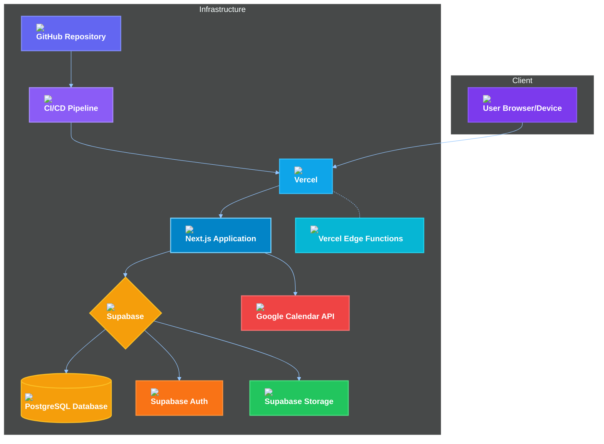

# SKILLIZE MVP - DEPLOYMENT & DEVOPS

## Deployment Overview

Skillize MVP is designed for modern cloud deployment with a focus on scalability, reliability, and security. This document outlines the deployment architecture, CI/CD pipeline, environment configuration, and DevOps best practices for the application.

## Deployment Architecture

Skillize MVP follows a serverless-first architecture leveraging several cloud services:



### Key Components

1. **Vercel Platform**
   - Hosts the Next.js application
   - Provides edge functions for API routes
   - Handles CDN and asset optimization
   - Manages SSL certificates

2. **Supabase**
   - Manages PostgreSQL database
   - Provides authentication services
   - Handles file storage
   - Real-time subscriptions (for future features)

3. **External APIs**
   - Google Calendar API for calendar synchronization

## CI/CD Pipeline

The continuous integration and deployment pipeline automates the testing, building, and deployment processes:

```mermaid
%%{init: {'theme': 'dark', 'themeVariables': { 'fontSize': '16px', 'primaryColor': '#8b5cf6', 'primaryTextColor': '#fff', 'primaryBorderColor': '#8b5cf6', 'lineColor': '#a78bfa', 'tertiaryColor': '#4c1d95' }}}%%
flowchart LR
    classDef developerClass fill:#0ea5e9,stroke:#38bdf8,stroke-width:2px,color:white,font-weight:bold
    classDef repoClass fill:#3b82f6,stroke:#60a5fa,stroke-width:2px,color:white,font-weight:bold
    classDef actionClass fill:#8b5cf6,stroke:#a78bfa,stroke-width:2px,color:white,font-weight:bold
    classDef ciClass fill:#6366f1,stroke:#818cf8,stroke-width:2px,color:white,font-weight:bold
    classDef branchClass fill:#f59e0b,stroke:#fbbf24,stroke-width:2px,color:white,font-weight:bold
    classDef prodClass fill:#ef4444,stroke:#f87171,stroke-width:2px,color:white,font-weight:bold
    classDef stagingClass fill:#f97316,stroke:#fb923c,stroke-width:2px,color:white,font-weight:bold
    classDef previewClass fill:#10b981,stroke:#34d399,stroke-width:2px,color:white,font-weight:bold
    classDef testClass fill:#06b6d4,stroke:#22d3ee,stroke-width:2px,color:white,font-weight:bold
    
    A([<img src='https://cdn.jsdelivr.net/gh/devicons/devicon/icons/github/github-original.svg' width='20'> Developer Commit]):::developerClass --> B([<img src='https://cdn.jsdelivr.net/gh/devicons/devicon/icons/github/github-original.svg' width='20'> GitHub Repository]):::repoClass
    B --> C([<img src='https://cdn.jsdelivr.net/gh/devicons/devicon/icons/github/github-original.svg' width='20'> GitHub Actions]):::actionClass
    
    subgraph "CI Pipeline"
        C --> D([<img src='https://cdn.jsdelivr.net/gh/devicons/devicon/icons/nodejs/nodejs-original.svg' width='20'> Install Dependencies]):::ciClass
        D --> E([<img src='https://cdn.jsdelivr.net/gh/devicons/devicon/icons/eslint/eslint-original.svg' width='20'> Lint Code]):::ciClass
        E --> F([<img src='https://cdn.jsdelivr.net/gh/devicons/devicon/icons/typescript/typescript-original.svg' width='20'> Type Check]):::ciClass
        F --> G([<img src='https://cdn.jsdelivr.net/gh/devicons/devicon/icons/jest/jest-plain.svg' width='20'> Run Tests]):::ciClass
        G --> H([<img src='https://cdn.jsdelivr.net/gh/devicons/devicon/icons/nextjs/nextjs-original.svg' width='20'> Build Project]):::ciClass
    end
    
    H --> I{Branch?}:::branchClass
    I -->|main| J([<img src='https://assets.vercel.com/image/upload/v1588805858/repositories/vercel/logo.png' width='20'> Deploy to Production]):::prodClass
    I -->|develop| K([<img src='https://assets.vercel.com/image/upload/v1588805858/repositories/vercel/logo.png' width='20'> Deploy to Staging]):::stagingClass
    I -->|feature| L([<img src='https://assets.vercel.com/image/upload/v1588805858/repositories/vercel/logo.png' width='20'> Deploy to Preview]):::previewClass
    
    J --> M([<img src='https://cdn.jsdelivr.net/gh/devicons/devicon/icons/jest/jest-plain.svg' width='20'> Post-Deployment Tests]):::testClass
    K --> M
    L --> M
```



### Pipeline Stages

1. **Source Code Management**
   - GitHub repository with branch protection rules
   - Feature branch workflow with pull requests
   - Code reviews required for merges to main branches

2. **Continuous Integration**
   - Automated testing on each commit and pull request
   - Type checking with TypeScript
   - Linting with ESLint
   - Unit and integration tests with Jest and Testing Library

3. **Continuous Deployment**
   - Automatic deployments to corresponding environments
   - Preview deployments for pull requests
   - Production deployments after successful staging tests

## Environment Configuration

The application uses different environments for separation of concerns:

| Environment | Purpose | URL | Deployment Trigger |
|-------------|---------|-----|-------------------|
| Production | Live application | https://skillize.app | Merge to main branch |
| Staging | Pre-production testing | https://staging.skillize.app | Merge to develop branch |
| Preview | Feature testing | https://pr-{number}.skillize.app | Pull request creation |
| Local | Development | http://localhost:3000 | N/A |

### Environment Variables

Environment variables are managed securely and separately for each environment:

```typescript
// Environment variable structure (defined in .env.example)
// Database
NEXT_PUBLIC_SUPABASE_URL=
NEXT_PUBLIC_SUPABASE_ANON_KEY=
SUPABASE_SERVICE_ROLE_KEY=

// Authentication
NEXTAUTH_URL=
NEXTAUTH_SECRET=
JWT_SECRET=

// Google Calendar API
GOOGLE_CLIENT_ID=
GOOGLE_CLIENT_SECRET=
GOOGLE_REDIRECT_URI=

// Application Settings
NEXT_PUBLIC_APP_URL=
NEXT_PUBLIC_APP_ENV=production|staging|development
```

Environment variables are stored and managed:
- **Local Development**: `.env.local` file (git-ignored)
- **Vercel Deployments**: Vercel Environment Variables UI
- **CI/CD Pipeline**: GitHub Secrets

## Infrastructure as Code

The infrastructure is defined and managed using code:

### Vercel Configuration

`vercel.json` configuration:

```json
{
  "version": 2,
  "buildCommand": "pnpm build",
  "devCommand": "pnpm dev",
  "installCommand": "pnpm install",
  "framework": "nextjs",
  "regions": ["iad1"],
  "headers": [
    {
      "source": "/(.*)",
      "headers": [
        {
          "key": "X-Content-Type-Options",
          "value": "nosniff"
        },
        {
          "key": "X-Frame-Options",
          "value": "DENY"
        },
        {
          "key": "X-XSS-Protection",
          "value": "1; mode=block"
        }
      ]
    }
  ],
  "redirects": [
    {
      "source": "/app",
      "destination": "/calendar",
      "permanent": true
    }
  ]
}
```

### Supabase Configuration

Supabase configurations are stored in the `supabase` directory:

```
supabase/
├── migrations/        # Database migrations
├── seed.sql           # Initial data seed
├── config.toml        # Supabase project configuration
└── functions/         # Edge functions
```

## Monitoring and Logging Architecture

```
                    ┌──────────────────┐                      ┌───────────────────┐
                    │Client Application│                      │Next.js Server     │
                    └─────────┬────────┘                      └────────┬──────────┘
                              │                                        │
        ┌──────────────┬──────┴──────────┐                   ┌─────────┴─────────┬─────────────┐
        │              │                 │                   │                   │             │
        ▼              ▼                 ▼                   ▼                   ▼             ▼
┌───────────────┐ ┌────────────┐  ┌────────────┐  ┌────────────────┐  ┌───────────────┐ ┌────────────┐
│Vercel         │ │Core Web    │  │Sentry Error│  │Application Logs │  │API Request    │ │Custom      │
│Analytics      │ │Vitals      │  │Tracking    │  │                │  │Logs           │ │Metrics     │
└───────┬───────┘ └────────────┘  └─────┬──────┘  └───────┬────────┘  └───────┬───────┘ └─────┬──────┘
        │                                │                 │                   │               │
        │                                │                 └──────┬────────────┘               │
        │                                │                        ▼                            │
        │                                │                 ┌────────────┐                      │
        │                                │                 │Pino Logger │                      │
        │                                │                 └────────────┘                      │
        │                                │                        ▲                            │
        │                                │                        │                            │
        │                                │                 ┌────────────┐                      │
        │                                │                 │Database    │                      │
        │                                │                 │Logs        │                      │
        │                                │                 └────────────┘                      │
        │                                │                                                     │
        │                          ┌─────┴──────┬─────────────┐                               │
        │                          │            │             │                               │
        │                          ▼            ▼             ▼                               │
        │                   ┌────────────┐ ┌────────────┐ ┌────────────┐                     │
        │                   │Error       │ │Source Maps │ │Error Alerts│                     │
        │                   │Alerts      │ │            │ │            │                     │
        │                   └────────────┘ └────────────┘ └─────┬──────┘                     │
        │                                                       │                             │
        │                                                       │                             │
        │                                                       │                             │
        └────────────────────┐                                  │                             │
                             ▼                                  ▼                             │
                      ┌────────────────┐             ┌───────────────────┐                   │
                      │Alert Thresholds│             │Notifications      │                   │
                      └───────┬────────┘             └─────────┬─────────┘                   │
                              │                                │                             │
                              │                                │                             │
                              │                                ▼                             │
                              │                       ┌───────────────────┐                  │
                              │                       │On-Call Rotation   │                  │
                              │                       └───────────────────┘                  │
                              │                                ▲                             │
                              │                                │                             │
                              └────────────────────────────────┘                             │
                                                                                            │
                                                                                            │
                              ┌────────────────────────────────────────────────────────────┘
                              │
                              ▼
                      ┌────────────────┐
                      │Alert Thresholds│
                      └────────────────┘
```

### Application Logging

Structured logging using Pino:

```typescript
// src/lib/logger.ts
import pino from 'pino';

const logger = pino({
  level: process.env.LOG_LEVEL || 'info',
  transport: {
    target: 'pino-pretty',
    options: {
      colorize: true,
    },
  },
});

export default logger;
```

### Error Tracking

Error monitoring with Sentry:

```typescript
// src/lib/sentry.ts
import * as Sentry from '@sentry/nextjs';

Sentry.init({
  dsn: process.env.SENTRY_DSN,
  environment: process.env.NEXT_PUBLIC_APP_ENV,
  tracesSampleRate: 1.0,
  
  // Performance monitoring
  integrations: [
    new Sentry.BrowserTracing({
      tracingOrigins: ["localhost", "skillize.app"],
    }),
  ],
});
```

### Performance Monitoring

Performance is monitored using:
1. **Vercel Analytics**: Real user metrics and Core Web Vitals
2. **Sentry Performance**: Transaction monitoring and trace analysis
3. **Custom Performance Markers**: Key user journeys and operations

## Security Measures

The application implements several security measures:

### Authentication Security

1. **JWT Handling**
   - Short-lived access tokens (15 minutes)
   - Secure HTTP-only cookies for refresh tokens
   - CSRF protection
   
2. **Password Security**
   - Argon2id hashing algorithm for passwords
   - Password strength requirements
   - Account lockout after multiple failed attempts

### API Security

1. **API Rate Limiting**

```typescript
// src/middleware.ts - Rate limiting middleware
import { NextResponse } from 'next/server';
import type { NextRequest } from 'next/server';
import { Ratelimit } from '@upstash/ratelimit';
import { Redis } from '@upstash/redis';

const redis = new Redis({
  url: process.env.UPSTASH_REDIS_URL!,
  token: process.env.UPSTASH_REDIS_TOKEN!,
});

const ratelimit = new Ratelimit({
  redis,
  limiter: Ratelimit.slidingWindow(10, '10 s'),
});

export async function middleware(request: NextRequest) {
  // Only rate limit API routes
  if (request.nextUrl.pathname.startsWith('/api/')) {
    const ip = request.ip ?? '127.0.0.1';
    const { success } = await ratelimit.limit(ip);
    
    if (!success) {
      return NextResponse.json(
        { error: 'Too Many Requests' },
        { status: 429 }
      );
    }
  }
  
  return NextResponse.next();
}

export const config = {
  matcher: '/api/:path*',
};
```

2. **Input Validation**
   - Zod schema validation for all API inputs
   - Content Security Policy headers
   - XSS protection headers

### Data Security

1. **Data Encryption**
   - Data encrypted at rest (Supabase PostgreSQL)
   - Data encrypted in transit (HTTPS)
   - Sensitive data (OAuth tokens) encrypted with app-level encryption

2. **Database Security**
   - Row-Level Security policies
   - Least privilege database access
   - Prepared statements to prevent SQL injection

## Scalability Considerations

The application is designed to scale efficiently:

1. **Edge Computing**
   - API routes deployed to edge locations for low latency
   - Static assets served from CDN
   - Edge middleware for routing and security

2. **Database Scalability**
   - Connection pooling
   - Query optimization
   - Index optimization

3. **Caching Strategy**
   - SWR (Stale-While-Revalidate) pattern for data fetching
   - React Query for server state caching
   - Incremental Static Regeneration for semi-static pages

## Backup and Disaster Recovery

Data protection measures include:

1. **Database Backups**
   - Automated daily backups
   - Point-in-time recovery capability
   - 30-day retention period

2. **Disaster Recovery Plan**
   - Multi-region database redundancy
   - Recovery time objective (RTO): 1 hour
   - Recovery point objective (RPO): 5 minutes

## Local Development Setup

Instructions for setting up the local development environment:

### Prerequisites
- Node.js 18+
- pnpm
- Supabase CLI
- Git

### Setup Steps

1. **Clone the repository**
   ```bash
   git clone https://github.com/your-organization/skillize-mvp.git
   cd skillize-mvp
   ```

2. **Install dependencies**
   ```bash
   pnpm install
   ```

3. **Set up environment variables**
   ```bash
   cp .env.example .env.local
   # Edit .env.local with your configuration
   ```

4. **Start local Supabase**
   ```bash
   supabase start
   ```

5. **Run migrations and seed data**
   ```bash
   supabase db reset
   ```

6. **Start the development server**
   ```bash
   pnpm dev
   ```

## Deployment Procedures

### Production Deployment

1. **Automated Deployment**
   - Merge to `main` branch
   - CI/CD pipeline runs tests and builds
   - Automatic deployment to Vercel production environment

2. **Manual Deployment** (if needed)
   ```bash
   # Make sure you're on the main branch
   git checkout main
   git pull
   
   # Deploy to production
   vercel --prod
   ```

### Database Migrations

Database migrations are handled through the Supabase migration system:

1. **Create a new migration**
   ```bash
   supabase migration new add_new_table
   ```

2. **Apply migrations locally**
   ```bash
   supabase db reset
   ```

3. **Apply migrations to production**
   ```bash
   # Production migrations are applied via CI/CD
   # or manually with:
   supabase db push --db-url=$PRODUCTION_DB_URL
   ```

## Common DevOps Tasks

### SSL Certificate Management

SSL certificates are automatically managed by Vercel.

### DNS Configuration

DNS records are managed through the domain registrar:

| Type | Name | Value | Purpose |
|------|------|-------|---------|
| A | skillize.app | 76.76.21.21 | Vercel production |
| CNAME | www.skillize.app | cname.vercel-dns.com | Subdomain redirect |
| CNAME | staging.skillize.app | cname.vercel-dns.com | Staging environment |
| TXT | _vercel | Verification string | Vercel domain verification |

### Adding New Environments

To add a new environment (e.g., beta):

1. Create a new branch (e.g., `beta`)
2. Set up the environment in Vercel
3. Configure environment variables
4. Set up the appropriate DNS records
5. Update CI/CD pipeline to deploy to the new environment

## Performance Optimization

The application implements several performance optimizations:

1. **Bundle Size Optimization**
   - Code splitting and dynamic imports
   - Tree shaking
   - Dependency optimization

2. **Image Optimization**
   - Next.js Image component with automatic optimization
   - WebP format preference
   - Responsive sizing

3. **Font Optimization**
   - Self-hosted fonts
   - Font subsetting
   - Display swap strategy

## See Also

- [Architecture Documentation](./02-architecture.md)
- [Database Schema](./06-database-schema.md)
- [State Management](./04-state-management.md) 